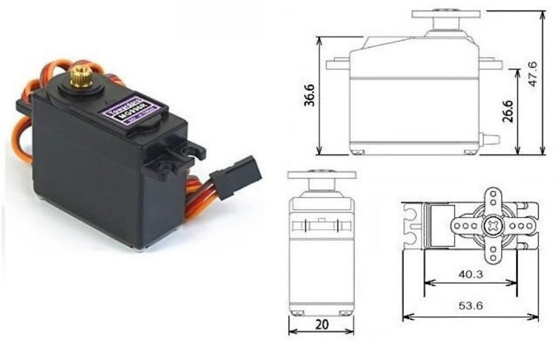
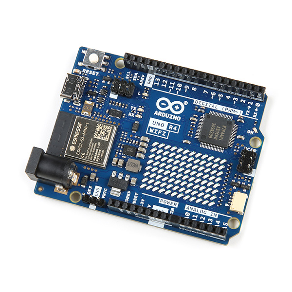
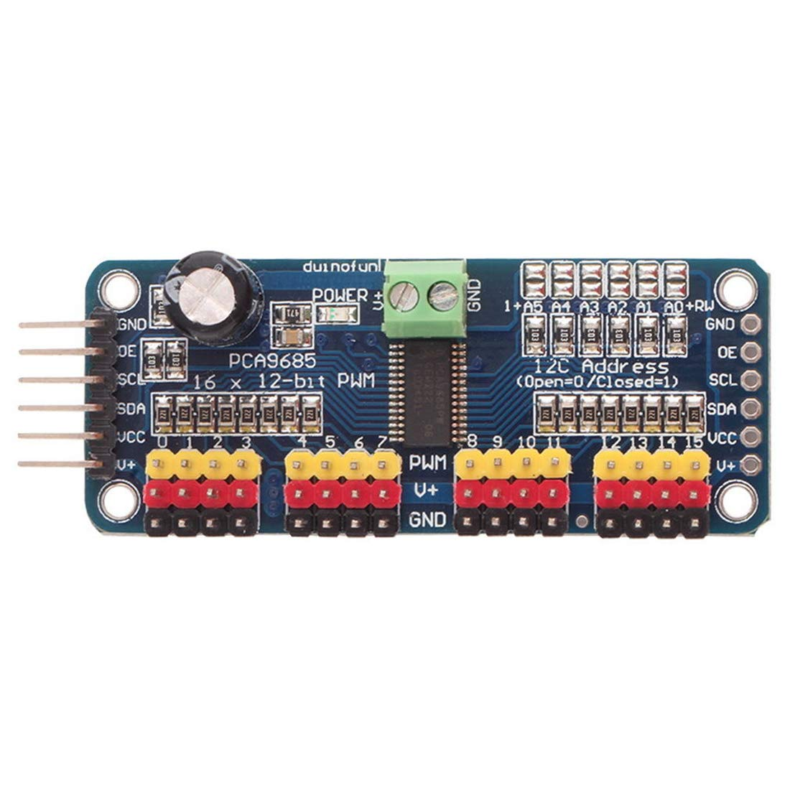

# Build Log for Hexapod Robot

- As a started, the hexapod joints are defined below. I will be refering to each joint by its name in this document. 

<div style="text-align: center;">

</div>

- I started by making a servo holder for the hip joint/coxa servo. This was designed to have the joint rotate about both sides for stability, so I made a peg at the bottom to be rotated about along with the matching servo horn at the top when the servo is slid into place.

- Along with the servo holder, I created a bracket that attached to the servo and the peg joint to start the movement of the coxa.

<div style="text-align: center;">


</div>

- This servos I will be beginning with for this project are the MG996R digital servos. They are cost effective and easily available as well as simple to get started with

<div style="text-align: center;">

</div>

- While my prints are running, I wanted to do some testing for my servos and servo driver. For this project, I will be starting out using the Arduino Uno R4 with WiFi. To control all 18 servos, I will be using two PCA9685 servo drivers. My initial test had the motor spinning while connected to the servo driver, although this was only one servo. I may need to calculate the required voltage needed to power more servos when they are connnected. I am currently using a 5V connection.

[servo_driver.webm](https://github.com/user-attachments/assets/af5060ce-9865-4fe0-bf7f-d872672bd5b9)






```
#include <Adafruit_PWMServoDriver.h>
#include <Arduino.h>
#include <SPI.h>

Adafruit_PWMServoDriver board1 = Adafruit_PWMServoDriver();       

#define SERVOMIN 125                                                
#define SERVOMAX  625  

int angleToPulse(int ang)                             
  {  int pulse = map(ang,0, 180, SERVOMIN,SERVOMAX); 
     Serial.print("Angle: ");Serial.print(ang);
     Serial.print(" pulse: ");Serial.println(pulse);
     return pulse;
  }                                             

void setup() {
  Serial.begin(9600);
  Serial.println("16 channel Servo test!");
  board1.begin();
  board1.setPWMFreq(60); 
}

void loop() 
  { for(int i=0; i<8; i++)
      { board1.setPWM(i, 0, angleToPulse(0) );}
    delay(1000);
    
    for( int angle =0; angle<181; angle +=10)
      { for(int i=0; i<8; i++)
          { board1.setPWM(i, 0, angleToPulse(angle) );}
      }
    delay(100);
  }

```


