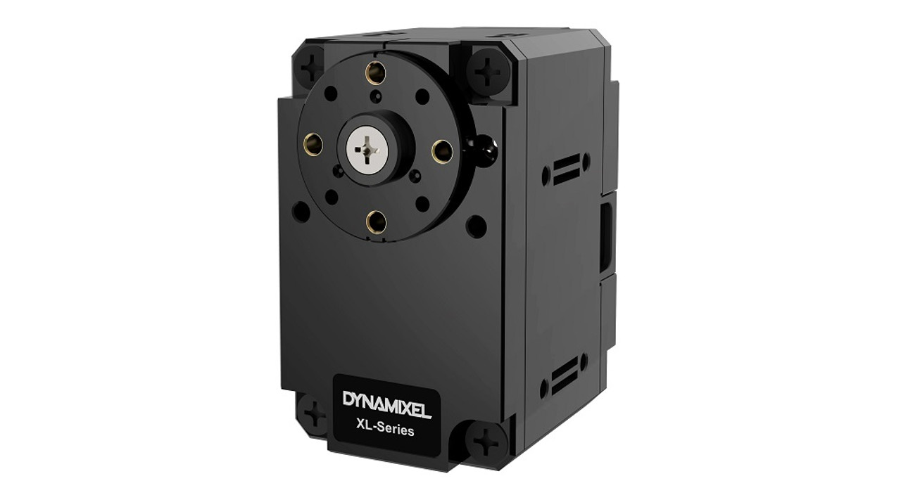
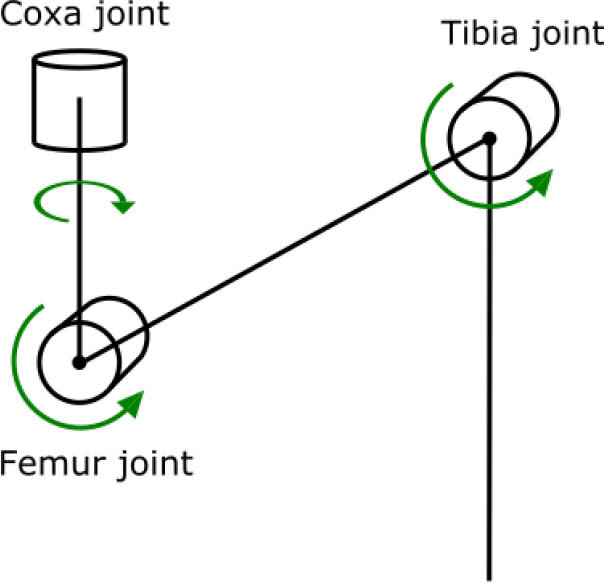

# Hexapod Build Log

- For this project, I opted to use the dynamixel motors and a Nvidia Jetson Orin Nano to control them. Dynamixel motors can be controlled by daisy chaining, allowing for easy wiring and (hopefully) programming.

 

- Before I got started programming the dynamixels, I wanted to build the CAD model for the first leg. To start with the model, I imported the dynamixel XL-430-250 T as well as the connectors that are also available from the same manufacturer. One connector is to have a joint connection on both sides of the servo for stability, and the other is to easily attach something to the servo such as the base, tibia, or femur.

    

 

- Below is a diagram of the joints beloinging to the hexapod, and this is how I will refer to them throughout this log:

    

