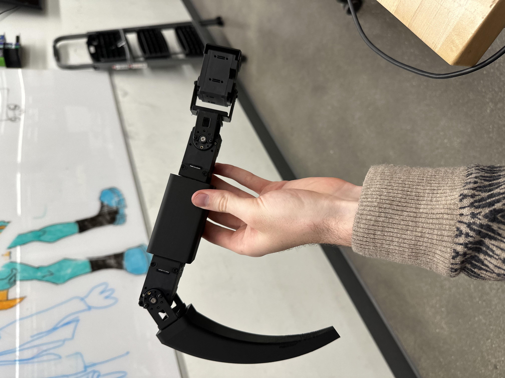

# Hexapod Build Log

- For this project, I opted to use the dynamixel motors and a Nvidia Jetson Orin Nano to control them. Dynamixel motors can be controlled by daisy chaining, allowing for easy wiring and (hopefully) programming.

- Before I got started programming the dynamixels, I wanted to build the CAD model for the first leg. To start with the model, I imported the dynamixel XL-430-250 T as well as the connectors that are also available from the same manufacturer. One connector is to have a joint connection on both sides of the servo for stability, and the other is to easily attach something to the servo such as the base, tibia, or femur.

- Here is a link to the E-manual for the servo I am using in this project
[Link Text](https://emanual.robotis.com/docs/en/dxl/x/xl430-w250/)

    

### Week 1
 

- Below is a diagram of the joints beloinging to the hexapod, and this is how I will refer to them throughout this log:

    

- After importing all of the models into Onshape's Assembly, I could build the femur and the tibia off of the existing pieces. Here is version one of the first hexapod leg with no base:

    

- After printing and putting the heated inserts into the femur and tibia, the final result
looked like this:

    

#### Building Materials 
- I will come back to this list later to order, so I thought I would list these down

- To attach the fastening brackets (they dont rotate), I just used the screws that came on the dynamixel. 

- **2.5mm*2.5mm*6mmSpacer (x72):** Fastening brackets I have not decided if I want ot 3d print the spacer or order it.

- **M2*4mm Screws (x132):** Fastening the joint brackets together, and attaching the joint brackets to either side of the servo horn. 

- **M2*8mm Screws (x128):** Attaching the femur and tibia to the joints via heated inserts

- **M3*8mm Screws (x18):** Attaching servo horn to servo motor

- **M2 * 8 * 3.5 Heat Inserts(x96)**: Attaching the brackets to the physcial parts of the femur and tibia, and attaching the entire leg to the base

 
 

- After getting the leg assembles, I was ready to try to program the dynamixel. I started by cloning the Dynamixel SDK and running their example file "read_write.cpp". Although I should have went through this code before (and ran it on a dynamixel not attached to anything), I went ahead and ran it. It worked! 

- Unfortunately, the code had the servo rotating 360 degrees, completely breaking my 3d printed bracket.

- Finally I imported that code into my project and edited the Makefile to run it from my personal directory. The dynamixel is moving!!

https://github.com/user-attachments/assets/1626d32c-aedb-42f3-aecb-51aee07d06fc

### Week 2
- This week I had several plans to optimze version one of my leg, and to get the servos working:

 

1. Make the femur shorter
2. Make the tibia longer
3. Put cutouts in both to have a lighted leg
4. Make supports so the cutouts wouldn't be too flimsy
5. Set up the Dynamixel Wizard to change the servo ids
6. Get my servos moving simultaneously 

 

- I ended up accomplishing all of these goals. Starting with the hardware, my new design looked a lot cooler and more functional. The new femur, tibia, and assembly is below:

    

 

- While this was printing, I wanted to test my servos to get them moving at the same time. I used the dynamixel wizard to change each servo unique ids and update all firmware. 

- I also edited the read_write code to move multiple servos at once. Once the new leg is printed I can start programming the inverse kinematics for one leg.

https://github.com/user-attachments/assets/9b11daee-581e-4daf-9013-fdc824fcda0e

- After making the servos move in sync, I put my new leg together and clamped it on the side of the table so I could start writing the Inverse Kinematic Equations. 

    

- Now it is time to solve some inverse kinematics! I have one joint that rotates on the x-y plane and two joints that rotate on the y-z plane. Lets start with the first joint.

    

1. Find the angle $\theta_1$ by looking at a top down view on the leg (since this joint moves on the x-y plane aka back and forth). Calculating this joint is not so bad since its joint one jont on the plane, meaning we can make use of the angle tan($\theta_1$) = $\frac{opp}{hyp}$ or tan($\theta_1$) = $\frac{x_{offset}}{y_{offset}}$. Rearanging this equation, we have for our first joint: 

$\theta_1 = \tan^{-1}\left(\frac{x}{y}\right)$

2. $\theta_3$ is the next easiest to find, as all we need to do is calculate the top angle of the red triangle above. For this we can implement the law of cosines:

$L^2 = R2^2 + R3^2 - 2R2R3 \cdot \cos(\theta_3)$

Rearranging this to solve for $\theta_3$ we have:

$\theta_3 = \cos^{-1}\left(\frac{R2^2 + R3^2 - L^2}{2R2R3}\right)$

3. Now that we have $\theta_1$ and $\theta_3$, we can solve for $\theta_2$. To get $\theta_2$, we need to first get $\phi_2$ and $\phi_1$. Once we get these values, we can subtract them to getting the reamining angle $\theta_2$.

4. $\phi_2$ - Despite how this looks, this is NOT a right triangle. This means we will one again have to deploy the law of cosines to get our answer. 

$\phi_2 = \cos^{-1}\left(\frac{R2^2 + L^2 - R3^2}{2R2L}\right)$

5. $\phi_1$ - Since you can make a rectangle or right angle out of the blue triangle, we can say that $\phi_1$ is equivalent to the interior angle at the end of the blue triangle. With this clever trick in mind, we can solve for $\phi_1$:

$\phi_1 = \tan^{-1}\left(\frac{z_{offset}}{y_{offset}}\right)$

6. Finally we can get $\theta_2$! NOTE: Since the z offset is negative, our $\phi_1$ also becomes a negative. To mitigate this, we now will add both $\phi_1$ and $\phi_2$ together to get a postivie angle.

7. Also, for the sake of simplicity I kept yoffset in the equation. But actually, yoffset is too long. Instead, in the code I calculate the distance between the first joint and the foot, then subtract the length between J1 and J2. This gives me the actual distance.

8. I struggled for a long time trying to figure out why hte equations weren't working. I was positive that the calculations were correct. Well it turns out these angles expect every joint to be set at a 0 angle. So in the code I first set the leg to its rest position (pass in xyz = 0), and then I calculate a position from there. In the future I will probably set all of my servos to the same joint position, so I can go to the home position easier.

 

- And with that, we have the inverse kinematics laid out for our leg! The next step was to test this out in code. I wrote a script for it by editing the original read_write.cpp file, but to no surprise it was more difficult to intergrate all together. While I had a break I decided to start designing the base of my robot. 

- I decided to make the base a hexagon (hexapod -> hexagon), which I think makes sense. Since I was know thinking about a base, I needed to have enough room to attach all of my electronics. 

- I had the Nvidia Jetson Orin Nano, U2D2 controller, and the yet was to be detemined. What power source should I use? How would I successfully daisy chain all of the servos in a clean way?

- I ended up getting this board from Trossen Robotics for the daisy chaining issue. Now keep in mind, I have no idea the amperage limits on this board, much less if it actually works yet. Thats on my to do list. The board is called 6 Port XM/XL Power Hub (3pin). 

    

- My next issue was the power supply. I needed a power supply for my Jetson (7~20V, 5A). I also needed a power supply for this board above (which I still have no idea if it works yet). According to my servos the operating voltage is 11.1V and the stall current is 1.3 amps. 

- For now, I wont worry about that, I will just keep my robot tethered to test everything.

### Week 3

- This week I designed the base, and got everything put together like it should. I also got the inverse kinematics working completely for one leg.

- One issue I have had is telling the leg to move 50mm in the z direction. After moving there, moving it back down -50mm goes further that it was originally. Soon I will experiment giving it smaller waypoints, so hopefully there will be less room for error.

    

https://github.com/user-attachments/assets/047964a4-c2c0-47c0-82e6-51405fc5a215

- This week my controller came in, so soon I will start trying to read joystick input, so I can eventually control the hexapod with it

- Currently, I am trying to print all of my parts. Each leg takes ~7 hours to print, and the base will most likely take about the same or a little less. After these parts are all printed, I can assemble the robot and do more in depth testing with a more stable connection.

### Week 4

- The Inverse Kinematics is finally working completely for one leg! This was my main hiccup that I used all of Week 3 to solve. 

- While putting together my legs via the 3d printed parts, my brackets started to break. This lead me to reinforce these brackets in CAD to make them much stronger and more stable

- The first iteration of my base has been designed, and I will be using acrylic to test it (because laser cutting is much faster than printing). 

- I want to wait to use my controller until I have most of the robot assembled until I start testing joystick input and event controls

https://github.com/user-attachments/assets/4bb8eb8e-8e12-4749-ad72-5f7c3612408d

    
    

- My first iteration of my base cut through after several passes on the laser, but I realized it was way to big for my robot. I decided that the next iteration should be smaller, and also circular for ease of design.

    

### Week 5

- 

