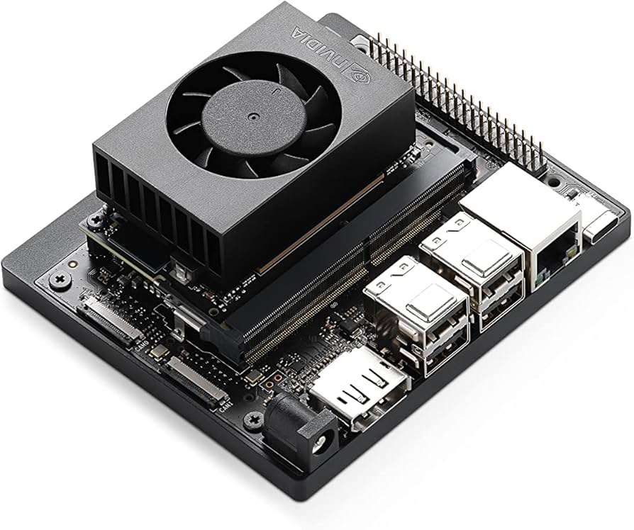
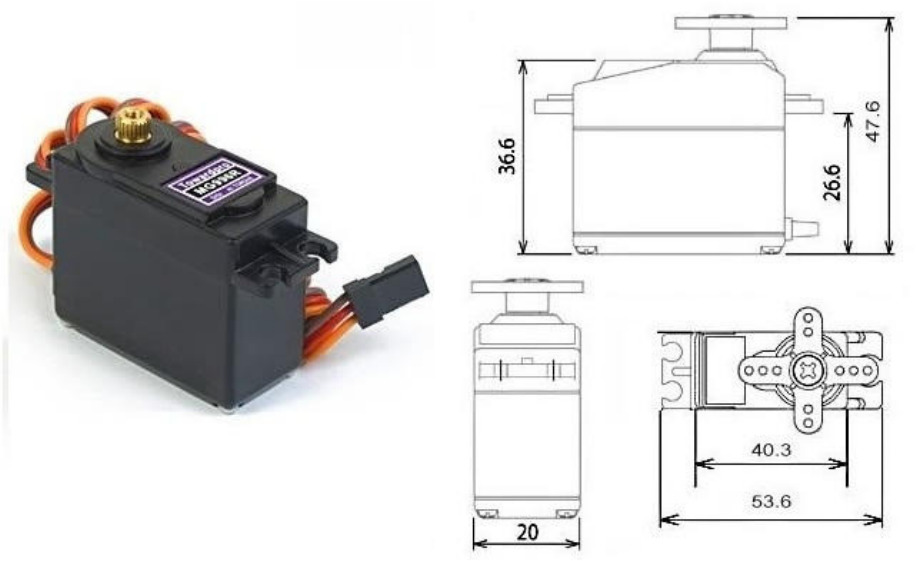
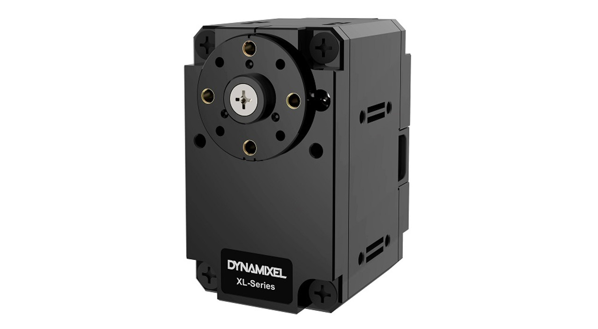

# Hexapod Project Proposal

## Project Description

- This project aims to mechanically design and program a hexapod robot that can walk with different gaits. Since a hexapod has six legs, it provides stability for walking on different types of ground, providing a robot that can navigate different landscapes for exploration, search and rescue, etc. The goal of this project is to design and build the hexapod legs and base, assemble it, and program it to move with at least three different walking gaits.

## Technical Objectives

#### Fallback Goal

- The hexapod is built and can at least move. If the building process is too in depth, a hexapod kit (which I already have) can be used in place of the build and be programmed. The kit comes with all motors and an acrylic frame. 

#### Core Goal

- The core goal of this project is to completely build the hexapod from scratch using CAD software for design and a 3d printer for creation. After assembly, the hexapod will be programmed to have different 3 different walking gaits for different types of movement.

#### Stretch Goal

- If everything goes well, more walking gaits could be added, or reinforcement learning can be implemented. With this accomplished, an optimzed gait could be found for a hexapod. 

## Learning Objective

- The ability to design and assemble a robot from scratch, giving me the knowledge of how each part works giving overall knowledge about the system.

- Use C++ to design a system from scratch in intergration with an embedded system to control a robot all onboard.

- Intergrating Inverse Kinematics in a real system to move the robot to a desired location.

BONUS GOAL
- Use a Reinforcemnt Learning Platform to integrate into a real robot

## Block Diagram

## Tasks

1. Design and print one leg for the Hexapod, using Onshape and a 3d printer. **2-3 weeks**

2. Test the servos and get Inverse Kinematics working on one leg. **1-2 weeks**

3. Print the next two legs and assemble half of the hexapod. **1-2 weeks**

4. Get the Inverse Kinematics implemented for half of the robot. **1-2 weeks**

5. Assemble the entire robot and implement Inverse Kinematics. **1-2 weeks**

6. Implement different style walking gaits for the hexapod. **1-2 weeks**

## Risks, Challenges, and Uncertanties

- The highest risk of failure is the mechanical design and printing. I do not have a lot of expertise in this area, so I allocated the most amount of time into this area.

- The only area that I am a little unsure about is the different style walking gaits, but if the Inverse kinematics is implemented well enough, it shouldn't be hard to understand the gaits.

- I plan to address the uncertainities by making many prototypes for my hexapod leg so I can fix the issues as fast as possible. I also plan to draw on knowledge of several Mechanical Engineering firends to help me with the design process. 

## Tools and Reference

#### Hardware

- Dynamixel Servos or MG996R Servo 
- Nvidia Jetson Orin Nano or Arduino Uno R4
- 3d printed parts
- Connecting Wires
- U2D2 board (if using the Jetson)
- PCA9685 (if using the Arduino)
- Power Supply

#### Software
- VSCode
- C++
- Dynamixel SDK (Dynamixel)
- Platform IO (Arduino)

#### Reference Material
- Hexapod Build and Code Tutorial (YouTube)
https://www.youtube.com/@AecertRobotics

- MSR student past project
https://adityanairs.website/

#### Packages

- Servo Control
https://github.com/adafruit/Adafruit_CircuitPython_PCA9685 (MG996R)
https://github.com/ROBOTIS-GIT/DynamixelSDK (Dynamixel)

- Inverse Kinematics - I plan to implement this myself to get a deeper understanding of how it works for this specific use case